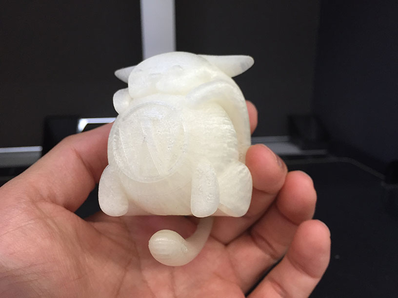
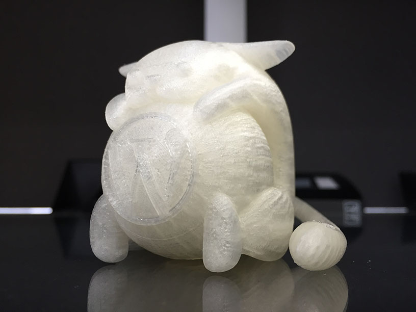
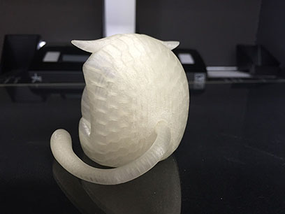

# 3D Wapuu

## Author, License, Version
Author : Takeshi Kashihara  
License: GPLv2 or later  
License URI: http://www.gnu.org/licenses/gpl-2.0.html  
Version : 1.0

## Description
This is 3D Wapuu polygon model data.  
You can use this data for 3DCG Software, and CAD software.  
And you can extrude 3D Wapuu thing by the 3D Priner.  

Wapuu is a official character of ja.wordpress.org, in Japan.  
He is loved by worldwide WordPress users.  

https://ja.wordpress.org/about-wp-ja/wapuu/  

## Data format
3D model data is in models directory.  
### For the 3DCG image, the animation.(for_the_3dcg)
.obj (cross-platform 3d-object format for the 3DCG image, the animation)  
.stl (stereolithography CAD data)

### For the 3D Printer image, the animation.(for_the_3d_printer)
.stl (stereolithography CAD data)

## Caution
Sorry, textures is not assigned.  
This version is polygon model only.  
## Changelog  
### 1.0 - March 2 2016
* First release.

